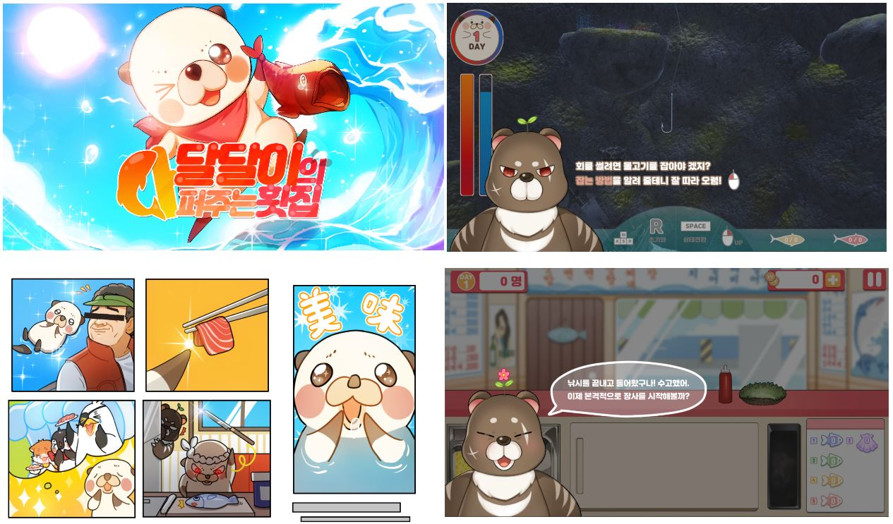
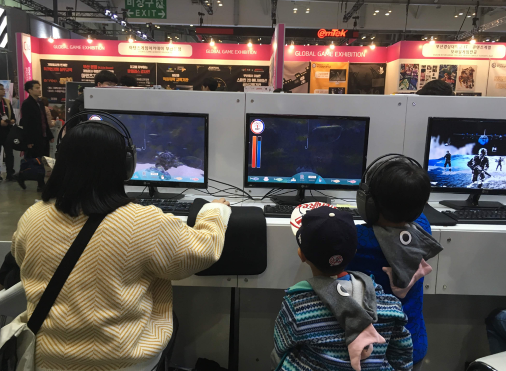

# [2019 G-Star 전시]달달이의 다 퍼주는 횟집

**개발:** C#, PC, Unity
**업무포지션:** 클라이언트 프로그래머

## 👩‍🏫PROJECT 소개

물고기를 잡고 요리를 해서 손님에게 판매하는 게임 , 2019 지스타 전시작품

🗓️ **작업기간** : 2019.03~2019.06

👨‍💻 **투입인원** : 5인 ( 개발자 2명 )

🙋‍♀️ **기여도 :** 60% 

📒 **주요업무** 

- 프로그래밍 팀장으로 게임 개발 (대학교)
- FSM 기반 물고기 AI 제작
- 프로젝트 관리
- 3D게임 파트 제작

🌱 **스킬 및 사용툴**

 `c#` `unity` `git` `visualStudio` `TUIO`

## 🖌️더 알아보기

### 플레이 동영상

[https://www.youtube.com/watch?v=fbwAchErRoM&feature=youtu.be](https://www.youtube.com/watch?v=fbwAchErRoM&feature=youtu.be)

### **2019 지스타**

